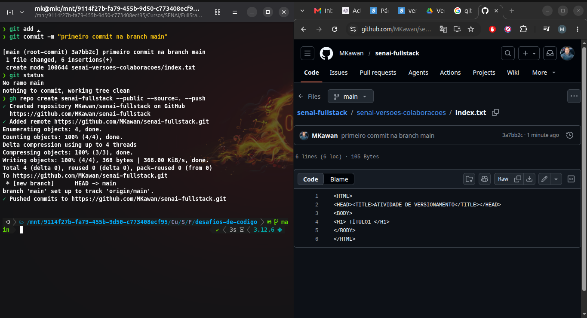
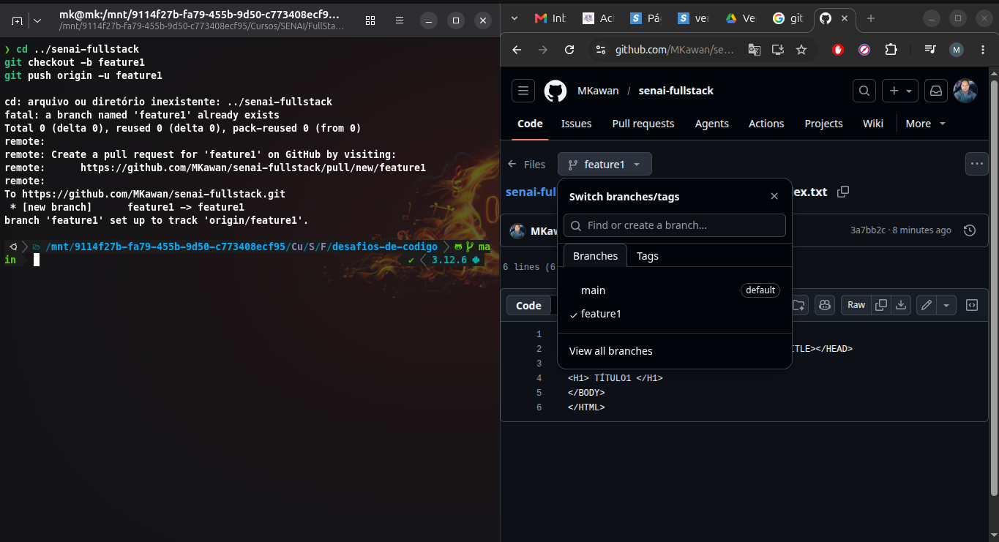
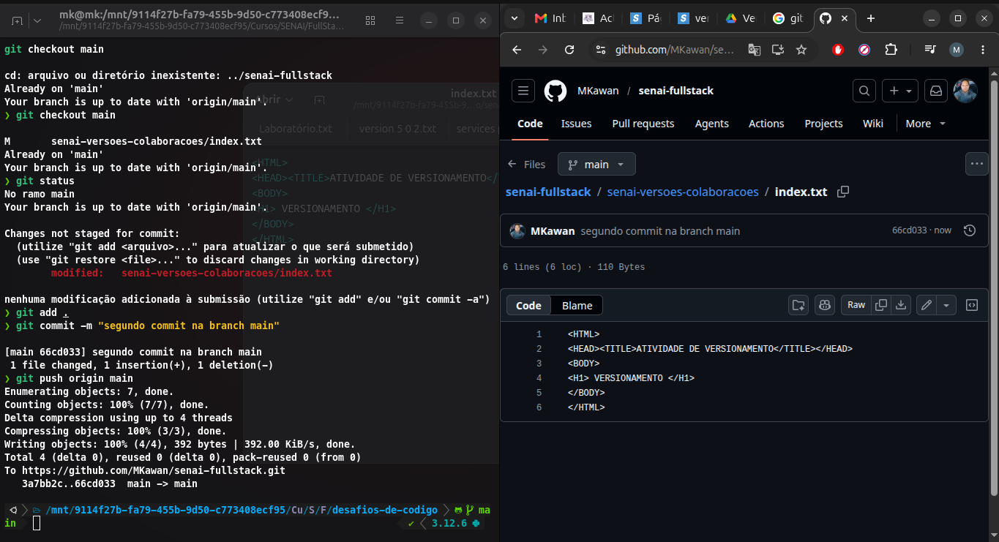
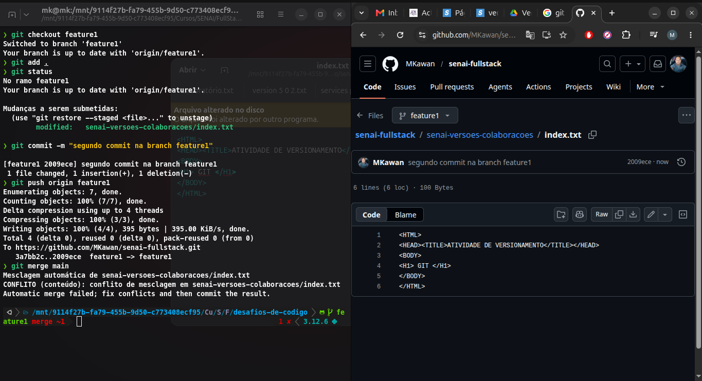
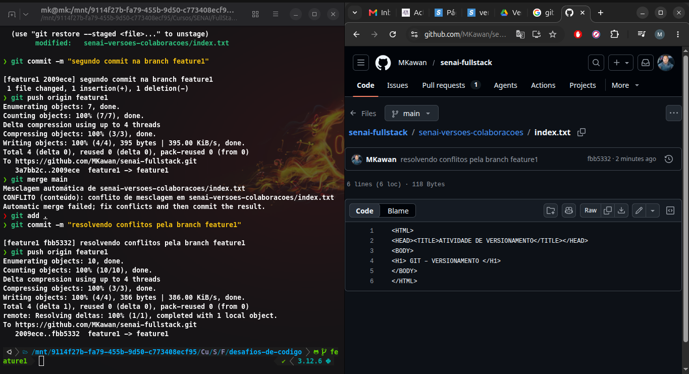

# VERSIONAMENTO

Curso senai Progamador FullStack :desktop_computer:.

Criando primeiro versionamento com git e github, utilizando prompt de comandos git :fire:.

Criar um arquivo index.txt no repositório local, copiar e colar as linhas de código indicadas abaixo :sparkles::

- Comandos utilizados :zap:.

```bash
git status
git add
git commit
git push
git checkout
git merge
git pull
git remote
```

### Primeiro branch main :rocket:.

```html
<html>
  <head>
    <title>ATIVIDADE DE VERSIONAMENTO</title>
  </head>
  <body>
    <h1>TÍTULO1</h1>
  </body>
</html>
```

- Publicar seu arquivo na branch main.



### Criando uma nova branch feature1 :rocket:.

```html
<html>
  <head>
    <title>ATIVIDADE DE VERSIONAMENTO</title>
  </head>
  <body>
    <h1>VERSIONAMENTO</h1>
  </body>
</html>
```

- Criar uma nova branch, chamada feature1.
- Na branch feature1, publicar o mesmo arquivo.
- Realizar seguinte alteração na linha h1 do
- arquivo da branch main:



- Realizar seguinte alteração na linha h1 do arquivo da branch feature1:

```html
<html>
  <head>
    <title>ATIVIDADE DE VERSIONAMENTO</title>
  </head>
  <body>
    <h1>GIT</h1>
  </body>
</html>
```



### Resolvendo conflito merge :rocket:.

- Para resolver esse conflito, entre no arquivo index.txt e realize as
  seguintes alterações no `<BODY>`:



```html
<html>
  <head>
    <title>ATIVIDADE DE VERSIONAMENTO</title>
  </head>
  <body>
    <h1>GIT – VERSIONAMENTO</h1>
  </body>
</html>
```

- main



- feature1


